Below my notes ! Careful not to get spoiled with some PSET content.

Enjoy!  

---

In most CS classes, we primarily focus on understanding the "what," not the "how." This means we are more interested in understanding how the abstraction operates rather than its actual implementation. This aligns with the principle of Separation of Concerns.

# Module 1: Elementary Logic Gates

## Boolean Operations

A truth table lists all the possible input/output combinations for a given computation. Below are some examples related to Boolean gates:

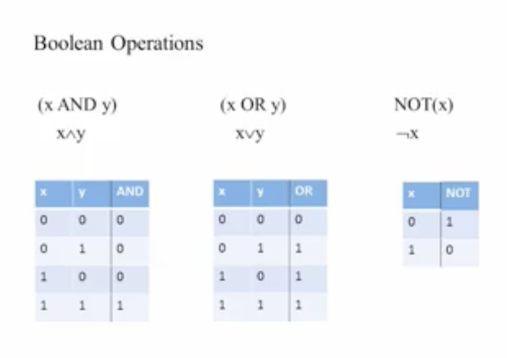

### Boolean Identities:

* Commutative Laws
* Associative Laws
* Distributive Laws
* De Morgan's Laws

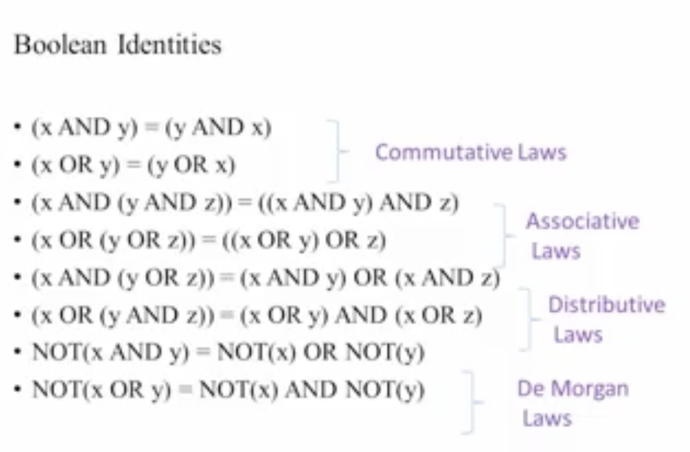

### Truth Table to Boolean Expression

* Solve each line of your Boolean gate matrix that resolves to 1 and OR them together. Simplifying the resulting expression is not straightforward as it's an NP problem.
* Any Boolean function can be represented using only AND and NOT operations, i.e., NAND.

## Gate Logic

Techniques for implementing Boolean functions using logic gates fall into the following categories:

* Elementary: NAND, AND, OR, NOT...
* Composite: Mux, Adder, ...

## Hardware Simulator

### Simulation Options:

* Interactive
* Script-based, dynamic testing
* With or without output and compare files

System engineers build a chip API, a test suite, and a comparator file so developers can implement these chips with known specifications and behaviors.

bus ==> array of bits

### Elementary Logic Gates

* Mux allows for programmable gates: custom gates A and B toggled by the selection bit.

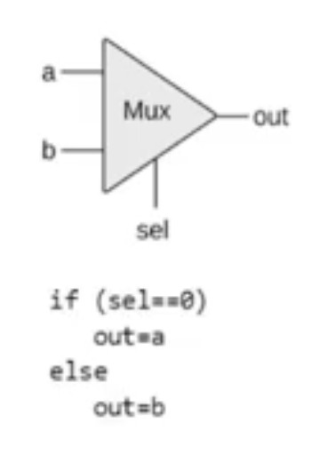

This has an interesting use case in networking. You can use the toggle bit to switch between two different messages composed of A and B, optimizing the use of a communication line.

## Pset 1:

Nand Gate

|a|b|out|
|-|-|---|
|0|0|1|
|0|1|1|
|1|0|1|
|1|1|0|

#### Going from the Nand gate to all required gates:

* *$Not$*: We'll use the fact that the *Nand* gate is the complement of *AND*, turns on when both bits (inputs a and b) are off and turns off when they're both on.
* *$And$*: Since *Nand* is the complement of *And*, and we got the *Not* gate implemented, we can just *Not* the returned *Nand* gate value.
* *$Or$*:  Apply Nand to the inverse of A and B.
* *$Xor$*: Exclusive Or, works when not both bits are equal to 1.
* *$Mux$*:

|a|b|sel|out|comments|
|-|-|---|---|--------|
|0|0|1|0|(A And Not Sel) or (b And Sel)|
|0|1|1|1|(A And Not Sel) or (b And Sel)|
|1|0|1|0|(A And Not Sel) or (b And Sel)|
|1|1|0|1|(A And Not Sel) or (b And Sel)|
|1|1|1|1|(A And Not Sel) or (b And Sel)|

* *$Dmux$*:

|in|sel|out|comments|
|--|---|---|--------|
|{a, b}|0|{in, 0}|out = {in And Notsel, in And sel}|
|{a, b}|1|{0, in}|out = {in And Notsel, in And sel}|

# Module 2: Boolean Arithmetic and the ALU Roadmap

Actual computer addition operates modulo word-size (the hardware-accepted bit-size for chunks of data). Overflowing additions result in the leading bit being ignored.

**Half-Adder**: Operates when your vector, comprising inputs A, B, and C (with C being the carry), has no carry. **Full-Adder**: Operates when your vector A, B, and C includes a carry C. **Multi-Bit Adder**: Consists of 1 Half-Adder (Rightmost Bit) and 15 Full-Adders for a 16-bit word-size.

**Negative Numbers**: Utilize Two's Complement representation for free additions and subtractions. Since both representation and addition are defined modulo 2, this approach is backward compatible. It's also noteworthy that bounded worlds align well with modular arithmetic.

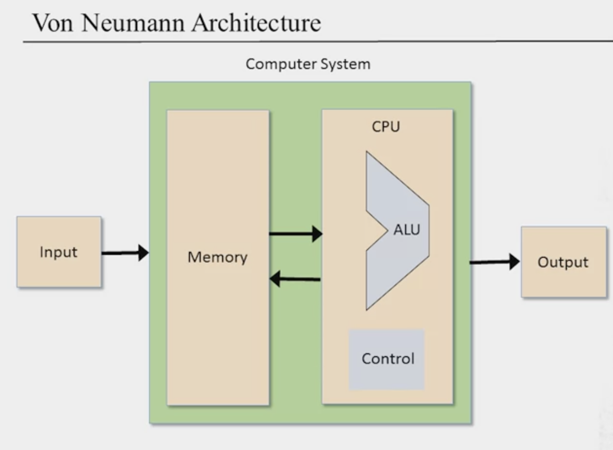

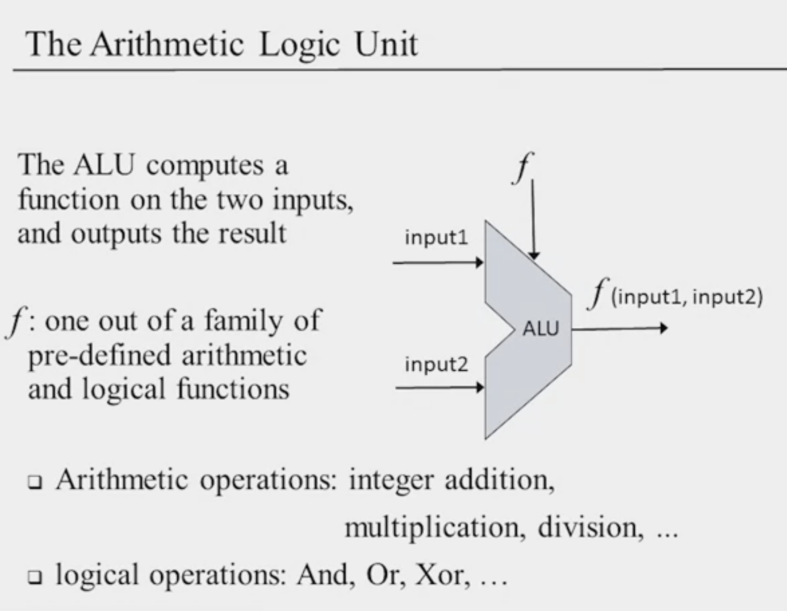

How much should be embedded on the hardware side? Software vs Hardware trade-offs!

## Pset 2:

* *$Half-Adder$*: Interesting to use a logical device to implement an arithmetic operation

|a|b|sum|carry|
|-|-|---|-----|
|0|0|0|0|
|0|1|1|0|
|1|0|1|0|
|1|1|0|1|

* *$Full-Adder$* : 

|a|b|c|sum|carry|
|-|-|-|---|-----|
|0|0|0|0|0|
|0|0|1|1|0|
|0|1|0|1|0|
|0|1|1|0|1|
|1|0|0|1|0|
|1|0|1|0|1|
|1|1|0|0|1|
|1|1|1|1|1|

carry is one whenever set to one. So can Xor tempCarryOne and Two. Then can just roll the

# Module 3:  Memory Roadmap

Memory serves as the time component of hardware. It allows you to:

* Reuse hardware over time
* Retain the "state" at each time point or step
* Deal with speed constraints, bound by the speed of transistor operation

Time is dealt with in clockwise dimension. Clocks flip from 1 to 0 continuously, and the time is just the counter of such flips. You can only have one operation per clock timesteps.

Basically, clock cycle need to be at least equal to the longest time needed for the operation to complete.

Split between combinational (instantaneous) logic and sequential logic (output at time t depends on input at time t-1). Sequential logic allows inputs and outputs to share the same variable or wire.

## Flip Flops

Be able to remember state n and state n+1. Basically shift the input one time-point to the right. 

We'll use a so-called Clocked Data Flip Flop. Usually, this has access to another chip that can transform physical time into clock-based time dimension. In the class dimension, that's abstracted away. 

1-Bit register persists value in memory by cleverly mixing MUX gates with a DFF chip.

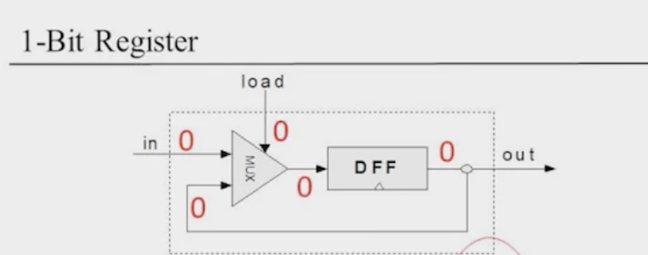

RAM vs non-volatile memory (disk) manifests as volatile/non-volatile storage. RAM holds data and instructions. Register width defines word size and computer specs.

RAM Unit => List of Registers!

PSET:

* Ram 8:
  * Address can be represented in log(8), DMux8Way will be enough to write/read in appropriate register
  * generate array of 8 registers:
    * if load = 1, use mux8way to toggle load at correct address ==> SELECTOR 1 FOR REGISTER Y GIVEN ADDRESS, SEL, AND LOAD VALUE
    * if load = 0,  then have load = 1 for address with DMUX: HAVE OUTPUT EQUAL REGISTER Y
      Consider the trade-off between slow and fast memory regarding cost. Embed both types in a computer for efficiency, leading to various cache levels. Frequently accessed data should reside in a fast cache as close to the CPU as possible

# Module 4:  Machine Language Roadmap

Assembler: Convert Assembly-Language to bits

See Machine Language as an interface between software and hardware. Usually, it supports what's implemented in hardware, and the rest is handled at the software level.

Here goes a sum-up sentence to describe machine language:

*agreed-upon formalism designed to manipulate a memory using a processor and a set of registers*

To remove bottlenecks in memory access (both in terms of size and latency), memory operates in layers: registers, cache, main memory, and disk. The access size increases as we move through these layers, but so does the latency. The closer the layer, the faster the access—ideal for frequently accessed items.

* Registers are located inside the CPU and serve as data or address registers.

## Hack computer

Follows von Neumann architecture.

Atomic unit: 16-bits. Specified in ROM:

* A-Instruction: targets memory.
* C-Instruction: performs computation with optional destination and jump post-computation. Computations are defined by the CPU and given as a list.

# Module 5: Computer Architecture Roadmap

Notice granularity in description vs module 2:

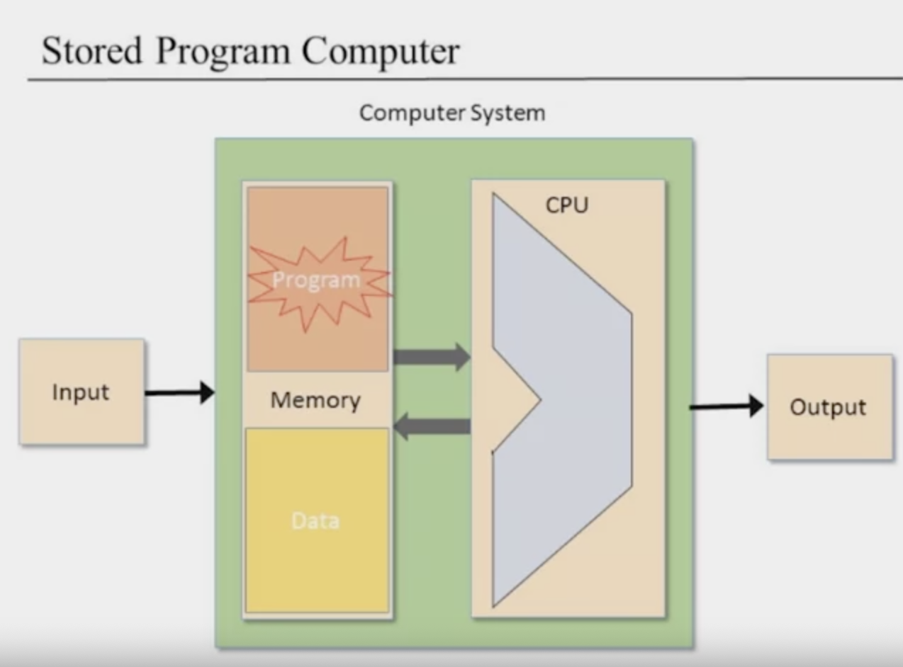

CPU: Registers + ALU

Memory: Data + Programs

Data, addresses, and control (wires, gates) flow between the CPU and Memory. For example, the ALU takes information from the data bus and manipulates it using control bits. Registers store addresses and data.

* Fetch instruction and execute architecture: Instruction feeds into the control bus and then into the ALU. Since two data buses are manipulated—the instruction and the actual data in memory—a multiplexer is used to toggle the gate of interest.
  * In the fetch cycle, toggle on the instruction data to pass it to the CPU register.
  * In the execution cycle, toggle in the address of manipulated data.

## Van Neumann vs. Harvard Architecture

* Van Neumann: Doubles the cycles but is more general (no need for roughly static/predictable memory usage).
* Harvard: Eliminates fetch-execute logic, consists of two memories, but requires a rough estimate of their memory space consumption.

PSET:

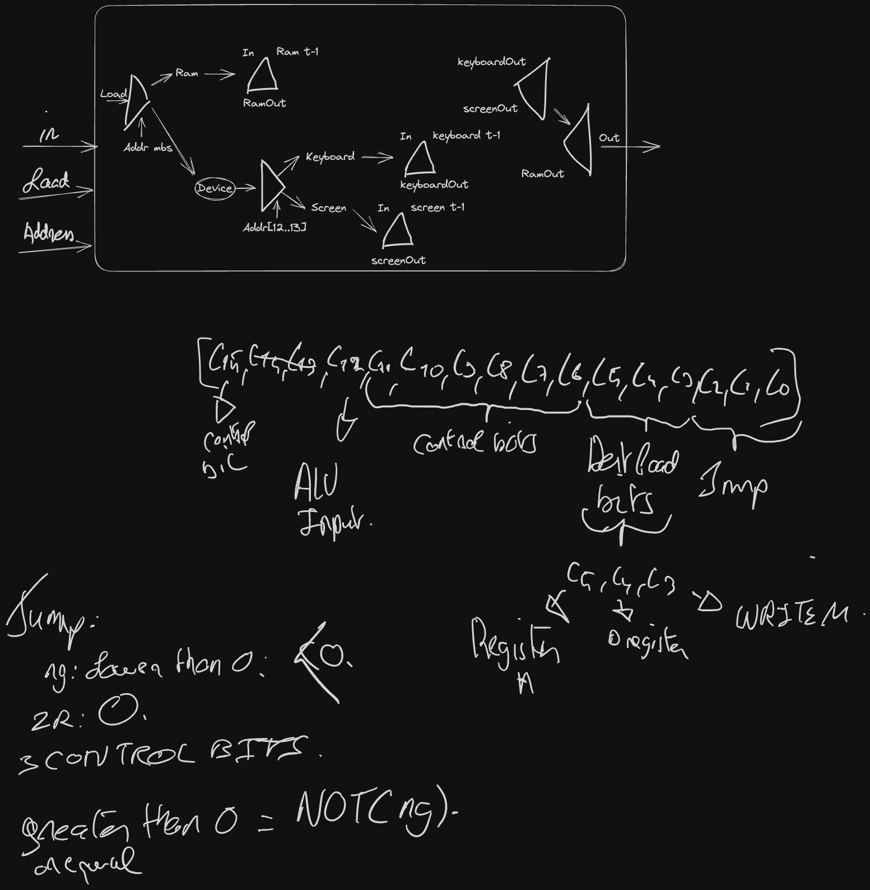

# Module 6: Assembler Roadmap

Deals with:

* White space
* Instructions
* Symbols (in step 2)

Two-pass assembler:

1. Create a dictionary for symbolic variable declarations, where the value points to the corresponding instruction.
1. Using the dictionary, translate assembly to binary representation. Be cautious with symbolic variables lacking a declaration; they'll refer to a memory point, starting at address 16 and incrementing from there.

**Module 1: Virtual Machine I: Stack Arithmetic**

**Two-tier compilation:**

* First, compile the high-level program down to VM code, then compile it to target hardware. This approach allows a program to run on any device, eliminating the need to write a different compiler for every machine. The first process is termed the "front-end", and the subsequent process is the "back-end".

**Popular VM Architecture:** The stack-machine architecture strikes an optimal balance by off-loading the right amount of tasks to both the front-end and the back-end. It offers complete abstraction of its existence concerning the high-level program code, as well as a full abstraction of the machine code from the stack-machine's perspective.

This architecture handles mathematical expressions and logical commands. Unlike other systems, memory segments in the stack-machine don't use symbolic variables. Instead, they reference memory segments by their names and indices.

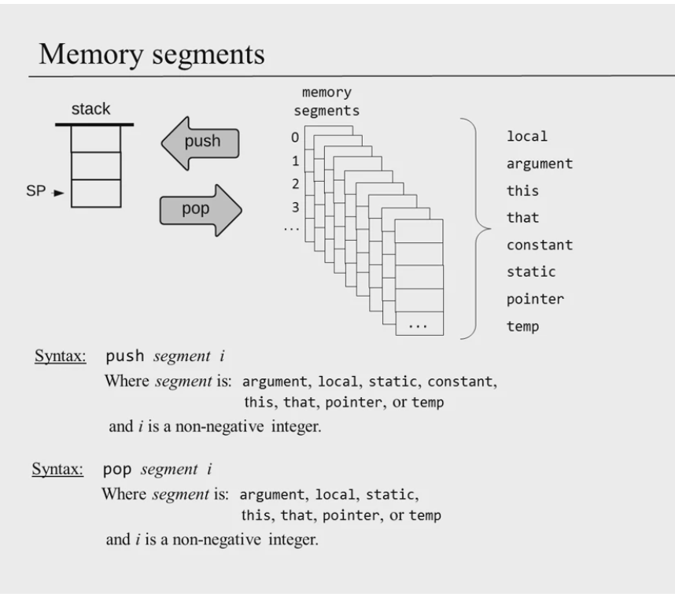

Think of the memory registers as places where the machine state is stored. In contrast, the stack serves as the processing unit. Here, arbitrary operations can be executed, and the results are persisted by transferring them to memory.

* **A:** Address register
* **M:** Memory register selected by A, meaning the Memory register whose address is determined by the current value of A.
* **A:** Acts as a Pointer
* **M:** Represents the Value at the pointer.

# Module 2: Virtual Machine II: Program Control

The architecture surrounding the stack and its various memory segments is intriguing. In loop architecture, values are typically "accumulated" through a cycle: they are computed, popped into their memory segment, pushed back onto the stack, and then the process is repeated.

Now, when dealing with two different stacks, one can conceptualize them in terms of frames or localities. For instance, when a function is invoked, distinct caller and callee stacks emerge. The `return` opcode pushes the last element of the callee stack into the caller stack.

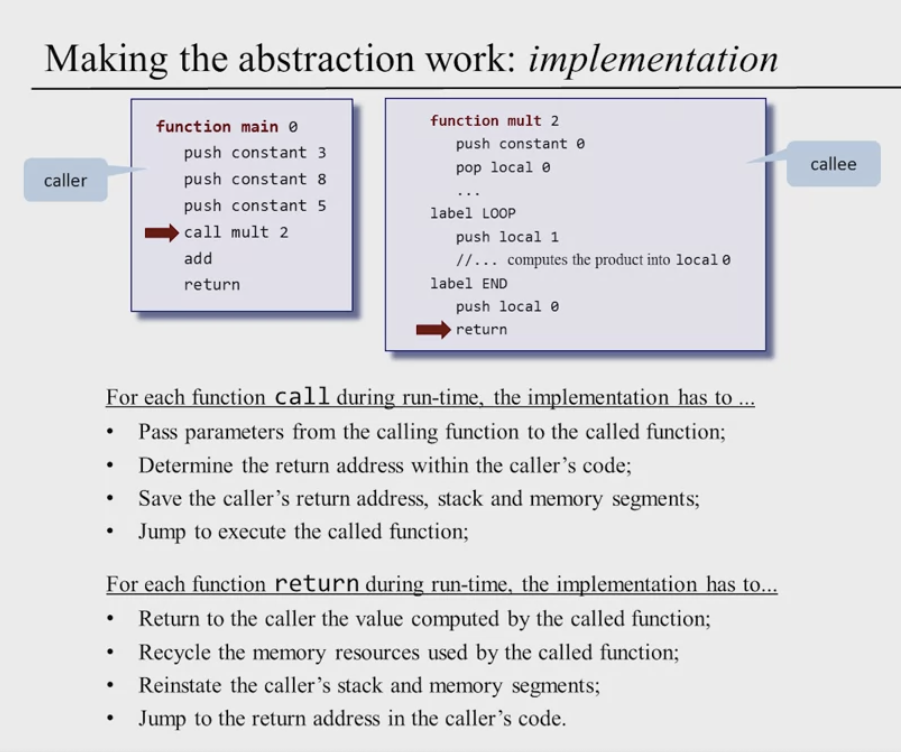

**Functions:**

* Each function maintains its unique state, characterized by a working stack and its memory segments.
* **Function Frame:** Predominantly made up of segment pointers from the caller.

Return steps:

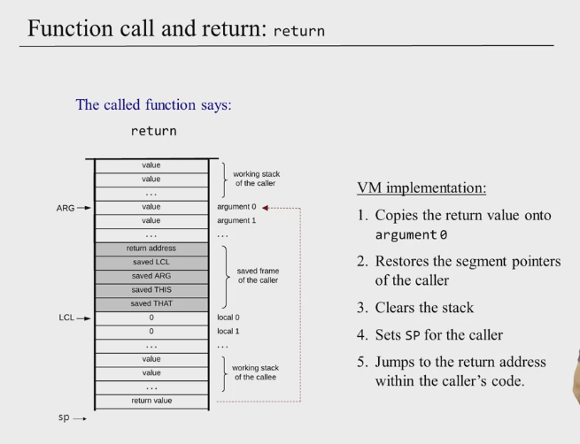

The stack's brilliance becomes evident in the function construct. It seamlessly manages memory and runtime operations while being an elegantly simple data structure.

**Caller:**

* Prior to invoking a function, it's essential to push `n` arguments onto the stack, where `n` represents the number of arguments the function anticipates.
* Post function execution, the arguments previously pushed to the stack are substituted by the return value. Moreover, all memory segments remain unchanged from their state before the function call, barring the STATIC and TEMP segments for apparent reasons.

**Callee:**

* Arguments are initialized with values passed in by the caller.
* The segment for local variables is allocated and initialized to zeros.
* The stack remains vacant.

**Handling Calls:**

**Handle Function Command (symbolic pointer, label):**

* Primarily involves constructing the local segment of the called function. Hence, push 0 onto the stack `nVars` times.

**Handle Return:**

* 
  It's crucial to discern between code processed by the CLR (Common Language Runtime, which uses two-tiered compilation with a VM step) and code that is executed directly on the hardware platform. While languages like C++ typically run directly, they can also utilize two-tiered compilations. Code processed by the CLR is termed "managed code", whereas the latter is known as "unmanaged code".

When code is executed within a VM environment, one can scrutinize the VM code for potential security threats, a task considerably more challenging with binary code. Additionally, this setup allows for sandboxing mechanisms.

# Module 3: High Level Language

**Syntactic sugar:** The beauty of programming languages lies in the way compilers abstract complexities from the developer. It's like a candy coating for code – easier to consume, but the core remains robust.

**Jack Language:** A fascinating embodiment of the advantages of strongly typed languages. These languages provide a safety net, catching many potential errors at compile time, ensuring greater code integrity. Nonetheless, with great power comes great responsibility. The safety-less construct of Jack does allow for very neat tricks.

# Module 4: Compiler I / Syntax Analysis

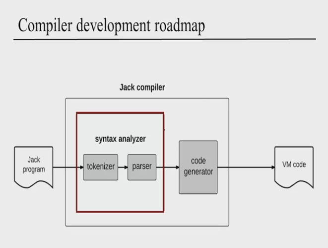

**Lexical Analysis**: Understanding lexical analysis is akin to delving into the semantics of a language. It involves recognizing the "words" of the language. Beginning with the grammar definition, it sets the guidelines for tokenization.

Parsing is the art of ensuring code components adhere to our predefined grammar rules. By components, we're referring to the series of tokens that make up the source.

At the foundation of the Jack program lie the lexical elements. They serve as the definitive tokens of the language.

# Module 5: Compiler II / Code Generation

The brilliance of two-tiered compilation becomes evident, especially in the realm of object-oriented languages. The process commences at the class-level and proceeds to the subroutine-level.

A crucial step is the conversion from infix notation to postfix, harmonizing it with the stack-machine paradigm

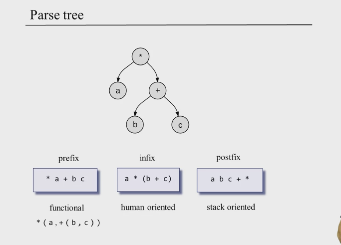

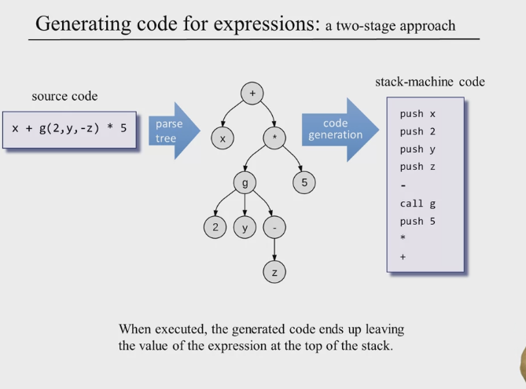

Objects and arrays find their home in the HEAP. The pointers 'this' and 'that' serve as guides to the base heap address, directing us to object data and array data respectively.

When we talk about compilers, extension isn't straightforward. Introducing concepts like inheritance can introduce static challenges. This journey through compilers sheds light on their recursive beauty, making their construction more intuitive. The nuances of data types become evident; for instance, strings in Jack language have an indefinite stay in the heap due to the absence of garbage collection.

# Module 6: Operating System

The operating system acts as the grand orchestrator, seamlessly bridging high-level languages with the underlying system. It's a vault of services, ranging from memory management and file system operations to I/O device driving and UI orchestration. It’s also a treasure trove of APIs that optimize a plethora of tasks - be it mathematical operations, networking tasks, or security-related processes.

When it comes to efficiency, bit-level operations reign supreme. Operating at this level often results in logarithmic time complexity, especially where loop structures are involved. Plus, such bit-centric operations pave the way for seamless porting of OS algorithms into tangible hardware.

Objects in memory are like treasure maps. While the stack might point to the treasure (data), the actual treasure resides in the heap.

Diving into the heap memory's linked-list structure, two aspects shine:

1. **Memory Allocation:** The quest here is twofold - allocate memory and maintain a vigilant eye on the heap's free memory regions.
1. **Memory Fragmentation:** Over time, as allocation and deallocation dance their endless waltz, memory undergoes fragmentation. This often beckons the need for a defragmentation process, silently operating in the backdrop for optimal memory utilization.

Vector graphics charm with their scalability. Being rooted in programmatic instructions related to graphics, they can be easily magnified or shrunk without any loss of clarity.

The symphony of the OS components is truly a marvel. Beginning from the memory layer, it builds layer upon layer, crescendoing to the pinnacle of system calls. The harmony achieved is nothing short of poetic.
